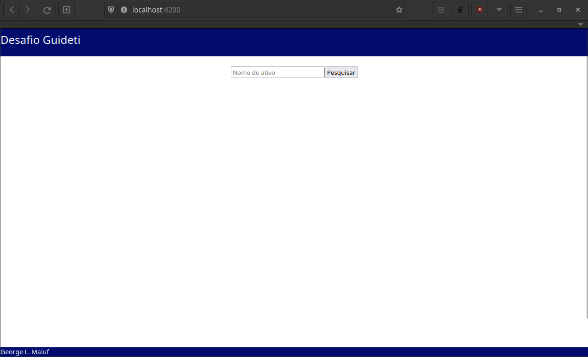

# Desafio Guideti
Este projeto é uma proposta de solução ao desafio descrito no arquivo [CHALLENGE.md](CHALLENGE.md).

<p align="center">
  
</p>

## 1 Requesitos
Qual sistema com Docker e Docker-Compose instalado e uma conexão com internet.

## 2 Arquitetura do Projeto
Este projeto é separado em dois artefatos:
* Api (backend): uma API REST escrita em Ruby on Rails, com destaque às seguites bibliotecas
  * RSpec
  * Simplecov
  * RSwag
  * ActiveModelSerializers
  * FactoryBot
  * Rubocop
  * DatabaseCleaner

* App (frontend): uma aplicação web escrita em Angular 14, com destaque às seguintes bibliotecas:
  * chart.js
  * ng2-charts

## 3 Configuração
### 3.1 Criar os containers em Docker
O primeiro passo para executar o projeto é criar os containers em Docker. Para isso execute no terminal:
```
$ docker-compose build
```
### 3.2 Configurar a base e dados de produção e de testes
Para configurar a base de dados de produção e de testes execute o seguite comandos no terminal:
```
$ docker-compose run api rails db:drop db:create db:migrate
```
Da mesma forma, para configurar a base de dados para a suite de testes da API, execute o seguinte comando:
```
$ docker-compose run api rails db:drop db:create db:migrate RAILS_ENV=test
```

## 4 Execução do Projeto
Para executar o projeto:
```
$ docker-compose up
```

Depois abra o endereço abaixo em seu navegador de preferência:
[http://localhost:4200/](http://localhost:4200/)


## 5 Testes automatizados no projeto backend (API)
Para executar a suite de teste automatizados do projeto API, execute no terminal:
```
$ docker-compose run api rspec --format=documentation
```
Ao final da execução da suite de testes, um relatório em HTML será gerado na pasta /api/coverage/index.html

## 6 Teste manual da API
Para executar um teste manual de requisição ao projeto da API, uma vez que o projeto esteja em execução usando o navegador, use o seguinte endereço:

[http://localhost:3000/api-docs/index.html](http://localhost:3000/api-docs/index.html)